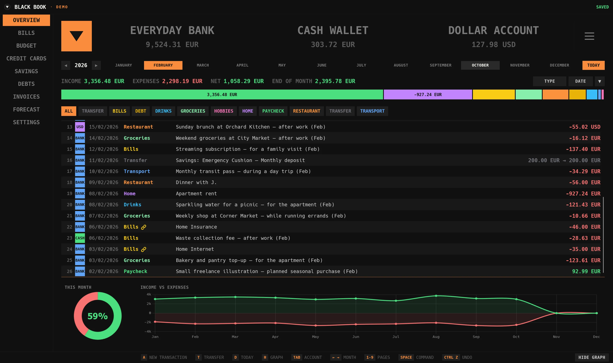

# BLACK BOOK

Your finances, on your computer. Black Book is a free personal finance app for tracking accounts, spending, bills, budgets, and savings, with a terminal-inspired interface and light and dark themes.



*The screenshot shows illustrative data. New installations start empty.*

[Download the latest release](https://github.com/NickNes9/blackbook/releases/latest) · [Report a problem](https://github.com/NickNes9/blackbook/issues) · [Full feature guide](functions.txt)

[Download Windows](https://github.com/NickNes9/blackbook/releases/download/v0.9.5/black-book-v0.9.5-win.zip) · [Download macOS](https://github.com/NickNes9/blackbook/releases/download/v0.9.5/black-book-v0.9.5-mac.zip) · [Download Linux](https://github.com/NickNes9/blackbook/releases/download/v0.9.5/black-book-v0.9.5-linux.zip)

## What you can do

- **See the whole picture.** View income, expenses, net income, and end-of-month balances. Filter transactions by account, category, month, or type, with charts that follow your selection.
- **Manage accounts and currencies.** Track cash and bank accounts, move money between them, and convert balances into your profile's chosen currency.
- **Stay on top of bills.** See a year of payments at a glance, record payments manually or automatically, and follow each payment to its transaction.
- **Plan your budget.** Set category limits or allocate a monthly total by percentage, with a donut chart showing where your money goes.
- **Track credit cards.** Manage purchases, installments, credit limits, and partial payments that accumulate until an installment is paid.
- **Build savings.** Set goals and follow progress through deposit and withdrawal histories.
- **Keep debts and invoices organized.** Track money owed, record repayments, reuse invoice templates, and link invoices to files on your computer.
- **Look ahead.** Project account balances over 30, 60, or 90 days using scheduled bills, installments, and recurring transactions.
- **Bring your history with you.** Import CSV, Excel, or JSON, review possible duplicates, and reuse category import rules. Export your records whenever you need them.
- **Make it yours.** Use separate profiles, optional profile passwords, custom colors and date formats, and categories that can be archived without losing their history.

Amount fields accept simple math such as `100-5*2-10`. You can select transactions to edit, delete, or merge them together, and undo or redo up to 100 recent supported financial changes during the current session.

## Get started

Download the ZIP for your operating system from the [latest release](https://github.com/NickNes9/blackbook/releases/latest), extract the entire folder, and open its launcher. Everything needed is included; no Node.js installation or terminal setup is required.

| System | Launcher |
| --- | --- |
| Windows 10/11 (64-bit Intel/AMD) | `Black Book.exe` |
| macOS (Intel or Apple silicon) | `Black Book.command` |
| Linux (64-bit Intel/AMD) | `Black Book.sh` |

The app opens in your browser and runs on your computer. Windows builds are tested; macOS and Linux packages are available but have not been tested on those systems.

Black Book is portable. Keep the whole extracted folder on your computer or a writable flash drive; profiles, backups, and updates stay inside it. Use the included **Stop Black Book** launcher before unplugging or moving the drive. Each operating system uses its own download.

Updates appear in the top notification bar and can be installed from Settings. Your existing profile data is preserved when updating.

### Install from the command line

For a source installation, install [Node.js](https://nodejs.org/) first. Release downloads already include it.

```sh
git clone https://github.com/NickNes9/blackbook.git
cd blackbook
npm install
npm start
```

Open [localhost:9597](http://localhost:9597). If that port is busy, the app tries `9999` and then other available ports.

## Your data

No online account is required. Profiles are saved locally in the `profiles` folder, which is excluded from the repository and release downloads. You can export JSON backups or CSV records from Settings; the app also keeps the previous saved file and makes a backup before replacing a profile through JSON import.

Optional profile passwords encrypt your saved data. Keep a backup and remember your password: a forgotten password cannot be recovered. Invoice file links point to the original file on your computer; the app does not copy the file into your profile.

Charts, fonts, and spreadsheet importing are bundled for offline use. Refreshing exchange rates and downloading updates require an internet connection.

## Useful shortcuts

| Key | Action |
| --- | --- |
| `A` / `T` | Add a transaction / transfer |
| `E` / `Delete` | Edit / delete selected transactions, or the hovered row |
| `Ctrl+Z` / `Ctrl+Shift+Z` | Undo / redo |
| `H` | Show or hide the graph |
| `/` or `Ctrl+K` | Open the command palette |
| `Esc` | Close a dialog |

The shortcut bar at the bottom shows the actions available on the current page.

## What's new

### 0.9.5

- Bills now has a donut chart alongside its line graph. Graphs keep their resized height when filters or categories change.
- **Check Data** identifies broken links, duplicate IDs, possible duplicate transactions, and missing exchange rates, with links to the affected records.
- Updates show download and installation progress, verify the download, and restore changed files if installation fails.
- Overview's category breakdown and graph follow the Type, Income, and Expenses filter. Account tiles fit narrow screens more reliably.

### 0.9.4

These changes were included in 0.9.5; there was no separate 0.9.4 download.

- Session undo and redo cover supported transactions, transfers, bills, credit cards, debts, savings, and invoice changes. Keyboard hints follow the page and selection.
- Partial installment payments accumulate toward the amount due, with progress markers sized to each installment.
- Payment histories link to their exact transactions, and deleting a linked transaction updates its payment record.
- Custom date formats stay on one line. Overview expenses plot below zero, and charts reflect selected transactions.

### 0.9.3

- Shift-click category cards to combine filters. Overview shows the selected month's closing balance, and selected transactions can be edited, deleted, or merged.
- Budget allocation uses a roomier editor with a live donut and Reset Plan. Categories can be archived from a chosen date while earlier history stays visible.
- Invoices support reusable templates, separate issue and paid dates, and local file links that open in your default app.
- Chart tooltips stay readable, amount fields support chained calculations and decimal commas, and bill payments match existing expenses in the correct month.

### 0.9.2

- Allocate a monthly budget across categories by percentage and carry the plan forward until changed.
- JSON import previews the contents and backs up the existing profile before replacement.
- Charts, fonts, and spreadsheet importing work offline.
- Invoice links use the computer's file picker and open the original file, including when using Firefox.

### 0.9.1

- Optional profile passwords encrypt saved data, with password changes and removal protected by the current password.
- Overview cycles through Type, Expenses, and Income with one filter button.
- Budget charts share the other pages' design, and the app uses port `9597` first, with `9999` as a fallback.

### 0.9.0

- Automatic update checks and a Forecast page for upcoming balances.
- Responsive layouts with compact account names and amounts on narrow screens.
- Safer saving preserves the previous file, while the app remains accessible only on your computer.
- Reliable amount calculations and searchable category pickers.

---

Created by Nikola Nešić · Black Book 0.9.5
- Portable downloads include the runtime: extract and open, with no separate Node.js installation. Each launcher opens its own installation; an empty installation prompts you to create a profile.
